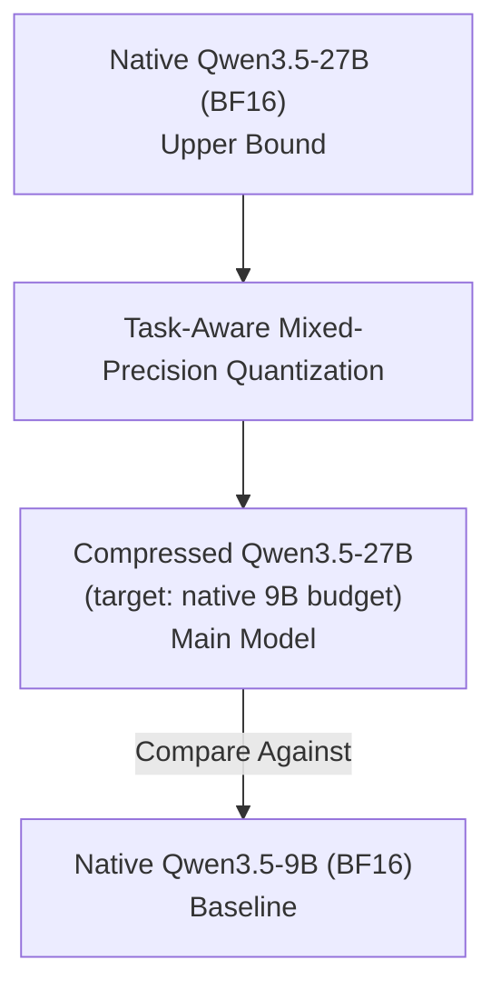

# 27B -> 9B Mainline

```mermaid
flowchart TD
    A["Native Qwen3.5-27B (BF16)<br/>Upper Bound"] --> B["Task-Aware Mixed-Precision Quantization"]
    B --> C["Compressed Qwen3.5-27B<br/>(target: native 9B budget)<br/>Main Model"]
    C -->|Compare Against| D["Native Qwen3.5-9B (BF16)<br/>Baseline"]
```

